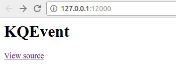
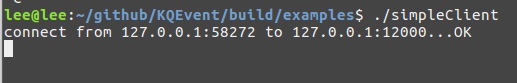
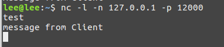
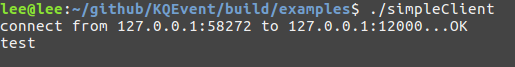

#KQEvent
  

KQEvent是一个LINUX下的Reactor网络库,使用`C++11`实现。意图展示一个基本的异步非阻塞网络库的实现，最终会在此基础上实现一个`Http Server`和一个`RPC`框架。
KQEvent的设计目标是：**方便使用**

### 编译
``` shell
./build.sh
```
编译之后会看到`build`目录下面有`samples`文件夹，里面是一些示例。

###示例:
#### TCPServer示例
```cpp
void TestServer(void){
    auto server = TCPServer::newInstance("127.0.0.1:12000");
    server->setConnectionNewHandler([](ConnectionPtr conn){
        std::cout << "new connection from "
                  << conn->getPeerAddr()->toString()
                  << " to " << conn->getHostAddr()->toString()
                  << std::endl;
    });

    server->setConnectionReadHandler([](ConnectionPtr conn, char *buf, size_t len){
        char msg[] =
                "HTTP/1.1 200 OK\n"
                        "Server: GitHub.com\n"
                        "Date: Mon, 19 Sep 2016 05:06:46 GMT\n"
                        "Content-Type: text/html; charset=utf-8\n"
                        "\n"
                        "<html>\n"
                        "<body>\n"
                        "\n"
                        "<h1>KQEvent</h1>"
                        "<a href=\"http://github.com/EmbolismSoil/KQEvent\">\n"
                        "View source</a>\n"
                        "\n"
                        "</body>\n"
                        "</html>";
        conn->sendMessage(msg, sizeof(msg));
        conn->softClose();
    });

    server->setConnectionCloseHandler([](ConnectionPtr conn){
        std::cout << " disconnect from "
                  << conn->getPeerAddr()->toString()
                  << " to " << conn->getHostAddr()->toString()
                  << std::endl;
    });

    server->run();
}
```
运行`simpleServer`,打开浏览器输入地址`127.0.0.1:12000`你会看到：



#### TCPClient示例
```cpp
void TestClient(void){
    std::string serverAddr("127.0.0.1:12000");
    auto client = TCPClient::newInstance(serverAddr);

    client->onConnected([](TCPClient::ConnectionPtr conn){
        std::cout << "connect from " << conn->getHostAddr()->toString()
                  << " to " << conn->getPeerAddr()->toString()
                  << "...OK" << std::endl;
    });

    client->onRead([&client](char *buf, size_t n){
        buf[n] = '\0';
        std::cout << buf << std::endl;
        char msg[] = "message from Client\n";
        client->sendMsg(msg, sizeof(msg));
    });

    client->onClose([](TCPClient::ConnectionPtr conn){
        std::cout << "disconnect from " << conn->getHostAddr()->toString()
                  << " to " << conn->getPeerAddr()->toString()
                  << "...OK" << std::endl;
        ::exit(0);
    });

    client->run();
}
```
打开终端使用`nc -l -n 127.0.0.1 -p 12000`监听端口， 运行`TCPClient`， 连接成功后随意输入字符串，你可以看到：



在`nc`所在的终端随意输入字符串，比如输入`test`你会看到：





###将会实现的特性
- 用户可以从内存池中分配内存，内存池跟踪内存的使用情况，跟踪内存生命周期，提供丰富的调试信息，必要时自动回收。降低用户内存管理的难度。
- 实现性能统计，可以在调试模式自动导出统计数据的图表形式。
- 基于无锁结构设计的高性能线程池
- 向用户提供高效的零拷贝的工具集

###正在进行的工作
- Buffer的设计
- Connection发送消息封装成消息包
- 精确定时器，时区转换
- 线程池
- Acceptor

## License
GPLv2
